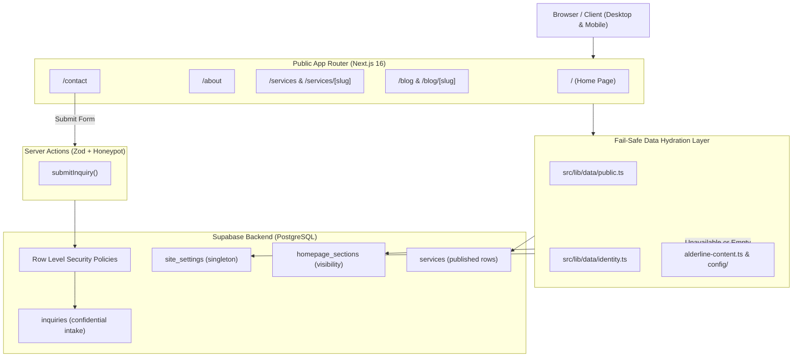

# UNIFIED INTEGRATION ARCHITECTURE: ALDERLINE ENVIRONMENTAL

## 1. Executive Summary
This document establishes the canonical software architecture for **Alderline Environmental**, combining:
- **Project A (`S:\Apps\ai-website-cloner`):** Approved environmental consulting frontend featuring responsive Webflow-parity layouts, 48 curated high-resolution media assets, 3 ambient background videos, and GSAP ScrollTrigger animations.
- **Project B (`S:\Apps\consultant`):** Robust Supabase backend featuring PostgreSQL tables, Row-Level Security (RLS) policies, Zod-validated Server Actions, anti-spam honeypot defense, and CMS data schemas.

The unified application resides in `S:\Apps\consultant` on branch `feature/unified-alderline-integration`.

---

## 2. Tech Stack & Environment
- **Framework:** Next.js 16.3.6 (App Router, React 19, TypeScript strict mode)
- **Bundler:** Turbopack
- **Styling:** Tailwind CSS with custom Alderline design tokens and Webflow utility classes
- **Motion & Interactions:** GSAP 3.15 + ScrollTrigger plugin (SSR-safe, prefers-reduced-motion, JSDOM test-safe)
- **Backend / Database:** Supabase (PostgreSQL 15+, Supabase SSR Auth, Row Level Security)
- **Validation:** Zod 3.25 schema validation
- **Image Pipeline:** `next/image` with AVIF and WebP format negotiation
- **Test Framework:** Vitest 5.0 with React Testing Library and JSDOM

---

## 3. Directory Layout
```
S:\Apps\consultant/
├── .agents/skills/          # Canonical cross-agent skills
├── docs/                    # Technical architecture & integration documentation
├── public/
│   ├── assets/alderline/    # 48 brand, hero, about, services, team, icon & video assets
│   ├── favicon.ico
│   └── site.webmanifest
├── src/
│   ├── app/
│   │   ├── (public)/        # Public website routes (Alderline brand & design)
│   │   │   ├── page.tsx     # Homepage (7-section narrative + CMS visibility integration)
│   │   │   ├── about/       # Multidisciplinary team & approach
│   │   │   ├── services/    # 4 core disciplines + deep dive template
│   │   │   │   └── [slug]/  # Dynamic service detail with CMS hydration
│   │   │   ├── blog/        # Insights & articles with category filters
│   │   │   │   └── [slug]/  # Dynamic editorial deep dive
│   │   │   ├── contact/     # Intake form wired to Supabase Server Action
│   │   │   └── utility/     # Legal, privacy, terms, and style guide
│   │   ├── admin/           # Secured admin surfaces & future CMS dashboard
│   │   ├── api/health/      # Health check endpoint
│   │   ├── globals.css      # Merged Alderline design tokens + animations
│   │   └── layout.tsx       # Root layout with Inter font & canvas background
│   ├── components/
│   │   ├── ecolia/          # Alderline presentation components (Navbar, Hero, About, etc.)
│   │   ├── forms/           # Contact form with honeypot & server action binding
│   │   ├── sections/        # Modular public server component sections
│   │   └── ui/              # shadcn/ui primitives
│   ├── config/              # Site config, navigation, services, projects, fonts
│   ├── lib/
│   │   ├── actions/         # Server Actions (submitInquiry, admin actions)
│   │   ├── data/            # Public fail-safe data readers (public.ts, identity.ts)
│   │   ├── supabase/        # Server, public, client, and admin Supabase clients
│   │   ├── alderline-content.ts # Authoritative content store
│   │   └── blog-data.ts     # Authoritative articles & case study data
│   └── types/               # TypeScript interfaces (CMS, inquiry, navigation)
└── tests/                   # 21 Vitest test suites (UI, auth, RLS, actions)
```

---

## 4. Architectural Data Flow



---

## 5. Content Precedence & Fail-Safe Strategy
1. **Frontend Presentation First:** Visual layout, media assets, and typography strictly follow approved Alderline design specifications.
2. **Authoritative Fallbacks:** `alderline-content.ts` and `blog-data.ts` supply complete, defensible content whenever database reads are unseeded, demo-mode, or offline.
3. **Graceful CMS Overrides:** When Supabase records exist and are marked visible/published, CMS values hydrate seamlessly (such as tagline overrides, published service modifications, and section visibility toggles).
4. **Resilient Public Routes:** Every public fetcher wraps database queries in a `runRead()` try/catch block that returns `{ data, available }` without throwing unhandled exceptions to the rendering tree.
